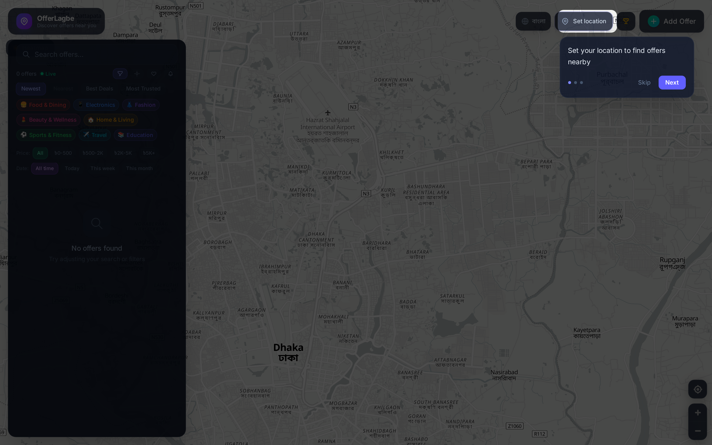
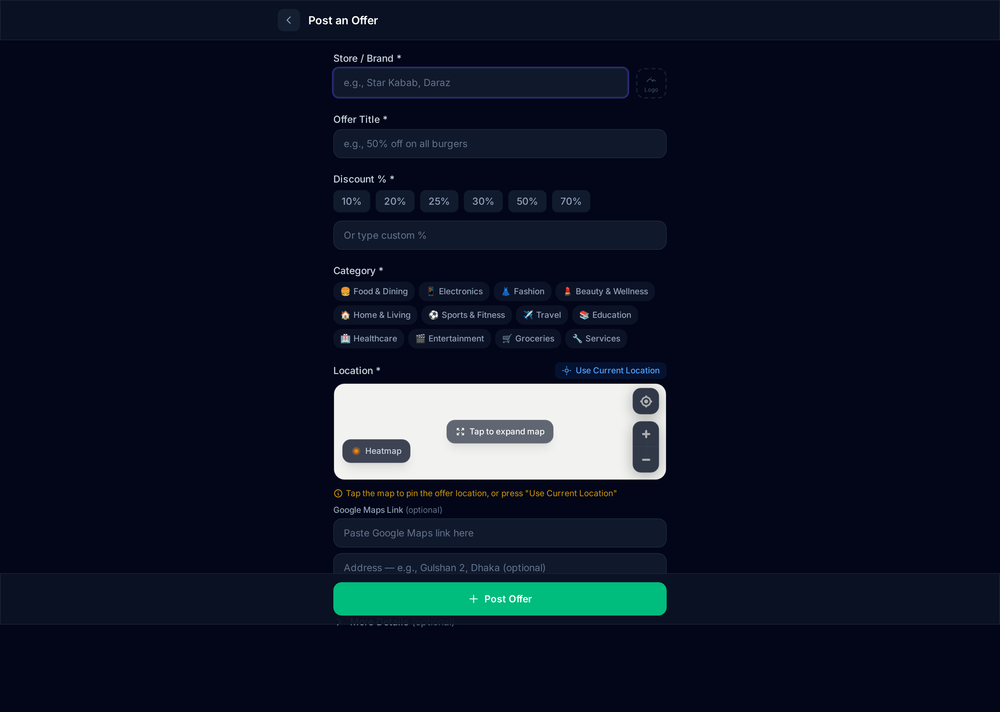
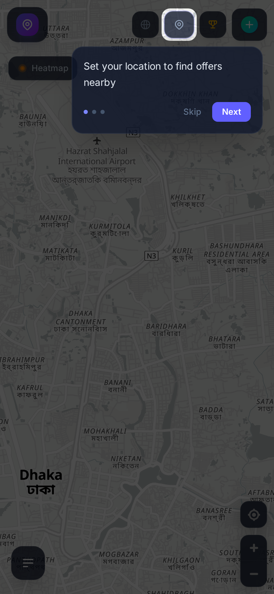
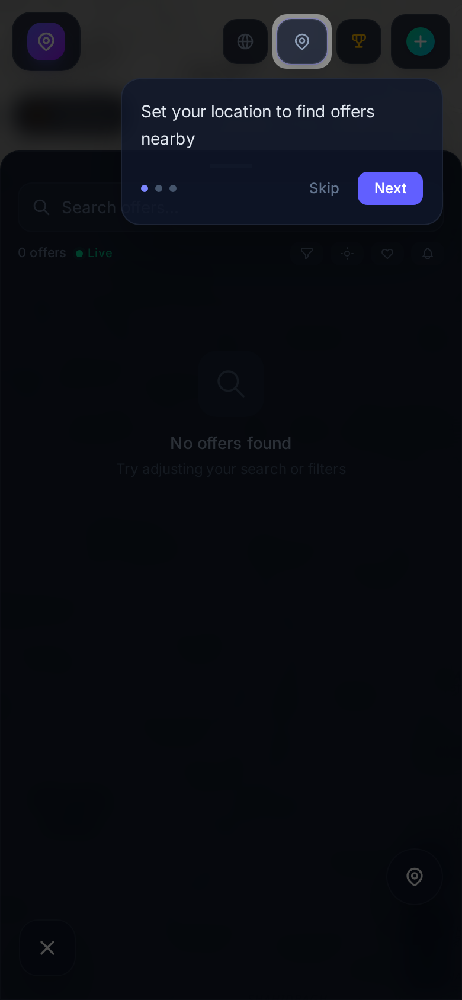
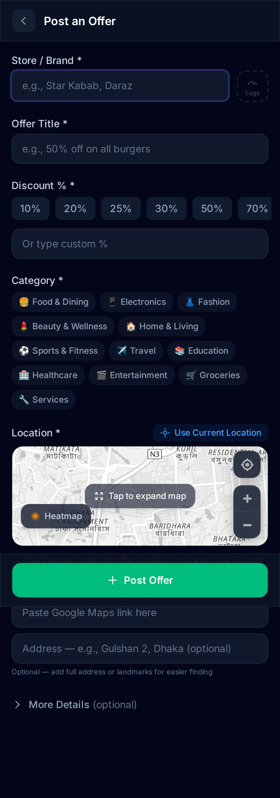
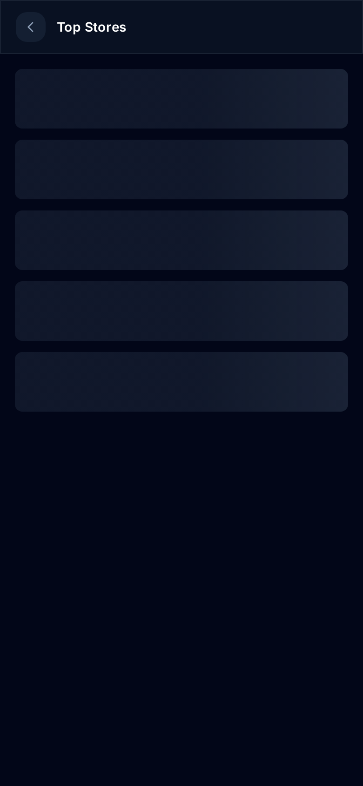

# OfferLagbe

**Discover and share the best deals, discounts, and offers near you in Bangladesh.**

> **Live:** [offerlagbe.netlify.app](https://offerlagbe.netlify.app/)

OfferLagbe is a real-time, map-based offer discovery platform built for Bangladesh. Users can anonymously post offers they find, vote on their authenticity, and discover deals happening nearby — all without creating an account.

---

## Screenshots

<table>
  <tr>
    <td align="center" width="50%">
      
      <br /><strong>Desktop — Map + Sidebar</strong>
    </td>
    <td align="center" width="50%">
      
      <br /><strong>Desktop — Submit Offer</strong>
    </td>
  </tr>
  <tr>
    <td align="center" width="33%">
      
      <br /><strong>Mobile — Map + Onboarding</strong>
    </td>
    <td align="center" width="33%">
      
      <br /><strong>Mobile — Bottom Sheet</strong>
    </td>
  </tr>
  <tr>
    <td align="center" width="50%">
      
      <br /><strong>Mobile — Submit Offer</strong>
    </td>
    <td align="center" width="50%">
      
      <br /><strong>Mobile — Top Stores Leaderboard</strong>
    </td>
  </tr>
</table>

---

## Why OfferLagbe? — The Psychology Behind It

OfferLagbe is designed around real behavioral psychology principles to create a self-sustaining community of deal hunters:

### Zero-Friction Onboarding
No sign-up, no email, no password. A unique visitor ID is generated locally in your browser. This removes the biggest drop-off point in any app — the registration wall. You open the app and you're already a member.

### Loss Aversion & FOMO
Offers are time-limited with live countdown timers. "Deal of the Day" creates urgency. The real-time "Live" indicator reminds you that deals appear and disappear at any moment. People are psychologically wired to avoid missing out on a good deal.

### Social Proof & Trust
The voting system creates visible social proof — an offer with 15 upvotes and a green "Community Verified" badge feels trustworthy. Photo verification adds another layer: real people uploading proof that a deal is legitimate. This solves the core trust problem of anonymous deal-sharing.

### Reciprocity Loop
When you benefit from someone else's shared deal, you naturally want to give back by posting deals you find. The leaderboard gamifies this — stores (and by extension, the people who post for them) get ranked, creating a virtuous cycle of contribution.

### Geographic Relevance
Map-first design means every offer feels personally relevant. Seeing a 50% discount pin 200 meters from your current location hits differently than browsing a generic coupon list. Proximity creates intent.

### Low-Cost Participation
Upvoting takes one tap. Commenting takes seconds. Even posting a deal is a simple 4-field form. The effort-to-reward ratio is deliberately skewed — minimal effort, maximum community value.

---

## Features

### Core
- **Interactive Map** — Browse offers on a MapLibre-powered map with clustering and popups
- **Heatmap Mode** — Toggle between bubble markers and heat density visualization
- **Anonymous Identity** — No sign-up required. A unique visitor ID is generated locally
- **Real-time Updates** — All data syncs instantly via Convex subscriptions
- **Offer Voting** — Community-driven trust system with upvotes/downvotes and auto-moderation
- **Community Verification Badge** — Offers with 5+ upvotes and 3+ comments earn a "Verified" badge
- **Photo Verification** — Users can upload proof photos to verify deals are real

### Discovery
- **Deal of the Day** — Gold-highlighted top-scoring recent offer
- **Trending Offers** — Hot deals from the last 48 hours
- **Best This Week** — Top-rated offers from the past 7 days
- **Top Stores Leaderboard** — Stores ranked by community upvotes and offer count
- **Nearby Offers** — See other deals within 500m of any offer
- **Store Pages** — View all offers from a specific store

### Submission
- **Google Maps Integration** — Paste a Google Maps link (including share links) to auto-detect location
- **Expandable Map Picker** — Tap the compact map to go fullscreen for precise pin placement
- **Duplicate Detection** — Warns before posting duplicate offers nearby, while allowing same brand at different locations
- **Scam/Fake Store Detection** — Auto-flags offers from stores with >50% flagged history
- **Image Upload** — Up to 5 photos per offer, auto-compressed to WebP format
- **Rich Text Descriptions** — Markdown subset support (bold, links, bullet lists)
- **Tag System** — Tags like "Verified", "Limited Stock", "Online Only", etc.

### Search & Filters
- **Sort** — By newest, nearest, best discount, or most trusted
- **Category Filter** — 12 categories (Food, Electronics, Fashion, etc.)
- **Price Range Filter** — Filter by price brackets
- **Date Filter** — Today, this week, this month
- **Near Me** — Filter offers within 5km radius
- **Saved Offers** — Bookmark and filter by saved offers

### Social
- **Comments & Replies** — Threaded comments with upvoting
- **Share** — Share via Web Share API or clipboard
- **WhatsApp Share** — Direct WhatsApp sharing button
- **Push Notifications** — Browser push notifications for new offers matching your preferences
- **New Offer Alerts** — Real-time toast notifications for nearby new submissions

### Mobile Experience
- **Responsive Bottom Sheet** — Full sidebar on desktop, swipeable bottom sheet on mobile
- **Swipe Actions** — Swipe right to save, left to dismiss offers
- **Back to Map FAB** — Floating button to close sidebar and return to map
- **Onboarding Tour** — 3-step tooltip walkthrough for first-time visitors
- **Sidebar-to-Map Navigation** — Clicking an offer in sidebar pans and zooms the map to its location

### Infrastructure
- **Skeleton Loading** — Shimmer placeholders while content loads
- **Offline Mode** — Cached offers available when offline via IndexedDB + Service Worker
- **PWA** — Installable as a Progressive Web App
- **OG Meta Tags** — Dynamic rich previews when sharing on WhatsApp/Facebook via Netlify Edge Functions
- **Bilingual** — Full English and Bengali (বাংলা) translations
- **Dark Theme** — Glass morphism dark UI with smooth animations
- **Countdown Timers** — Live countdown for expiring offers
- **Coupon Codes** — Copy-to-clipboard coupon code badges
- **Directions** — One-tap directions via Google Maps
- **Image Carousel** — Swipeable image gallery with lightbox

---

## Tech Stack

| Layer | Technology | Why |
|-------|-----------|-----|
| **UI Framework** | React 19 | Latest concurrent features, automatic batching, use() hook |
| **Routing** | TanStack Router | Type-safe file-based routing with built-in search params validation |
| **Styling** | Tailwind CSS v4 | Utility-first CSS with the new Oxide engine for faster builds |
| **Maps** | MapLibre GL JS + OpenFreeMap | Free vector map tiles — no API key, no usage limits, no vendor lock-in |
| **Backend** | Convex | Real-time database with live subscriptions — data syncs instantly without polling or WebSocket boilerplate |
| **Language** | TypeScript (strict) | End-to-end type safety from database schema to React components |
| **Build Tool** | Vite 7 (Rolldown) | Next-gen Rust-based bundler, sub-second HMR |
| **Package Manager** | Bun | 3-5x faster installs than npm, native TypeScript execution |
| **Linting** | Biome | Single tool for formatting + linting, 100x faster than ESLint + Prettier |
| **Deployment** | Netlify + Convex Cloud | Edge-deployed frontend + globally distributed serverless backend |
| **Edge Functions** | Netlify Edge (Deno) | Dynamic OG meta tags for social media previews at the edge |

### Architecture Decisions

- **No user accounts** — Anonymous by design. A `visitorId` is generated once in localStorage and used for all interactions. This eliminates auth complexity and lowers the barrier to participation.
- **Real-time first** — Convex subscriptions push updates to all connected clients instantly. No manual refresh needed — the UI shows a "Live" indicator instead.
- **Client-side computation** — Trending, Best This Week, and Deal of the Day are computed client-side from the full offer list via `useMemo`. This avoids extra backend queries and stays reactive.
- **Trust through voting** — Instead of human moderators, the community self-moderates. Offers are auto-flagged at <20% trust (15+ votes) and auto-removed at <10% trust (30+ votes). Recovery is possible if the community changes its mind.
- **Map-first UX** — The map is the primary interface, not a list. Geographic context is central to the value proposition.

---

## Getting Started

### Prerequisites

- [Bun](https://bun.sh) (recommended) or Node.js 18+
- A [Convex](https://convex.dev) account (free tier)

### Setup

```bash
# Clone the repository
git clone https://github.com/EhsanulHaqueSiam/offerlagbe.git
cd offerlagbe

# Install dependencies
bun install

# Set up Convex
bunx convex dev

# Start the dev server
bun run dev
```

### Seed Demo Data

After setting up Convex, you can seed demo offers via the Convex dashboard by running the `seed:seedOffers` internal mutation.

---

## Project Structure

```
convex/           # Backend: Convex schema, queries, mutations, actions
  offers.ts       # Offer CRUD, duplicate check, scam detection
  votes.ts        # Voting logic with trust system
  comments.ts     # Threaded comments with vote tracking
  notifications.ts # Push notification subscriptions
  verificationPhotos.ts # Photo verification system
  leaderboard.ts  # Top stores ranking
src/
  components/     # React components
    map/          # OfferMap, OfferBubbles (heatmap + clusters), OfferPopup
    offers/       # OfferCard, SubmitOfferForm, CommentSection, PhotoVerification
    notifications/ # Push notification settings
    voting/       # VoteButtons, TrustBadge
    ui/           # Header, Sidebar, Skeleton loaders, SwipeableCard, etc.
  hooks/          # Custom React hooks (offline, notifications)
  lib/            # Utilities (i18n, location, Google Maps parser, bookmarks, etc.)
  routes/         # TanStack Router file-based routes
  types/          # TypeScript type definitions
public/           # Static assets, Service Worker, manifest
netlify/          # Netlify Edge Functions (OG meta tags)
screenshots/      # Playwright-captured app screenshots
```

---

## Security

- All user inputs validated server-side with length limits and type checks
- Rate limiting on all write operations (offers, votes, comments, reports)
- XSS-safe markdown parser (escape-first approach)
- Content Security Policy headers
- Visitor IDs truncated in API responses to prevent impersonation
- SVG uploads blocked (XSS vector)
- Image compression to WebP before upload (max 300KB)
- Seed mutation is internal-only (not callable from client)
- Environment variables for all deployment-specific URLs

---

## Contributors

- **Ehsanul Haque Siam** — [GitHub](https://github.com/EhsanulHaqueSiam)
- **Aonyendo Paul** — [GitHub](https://github.com/nitpaul)

## License

MIT
